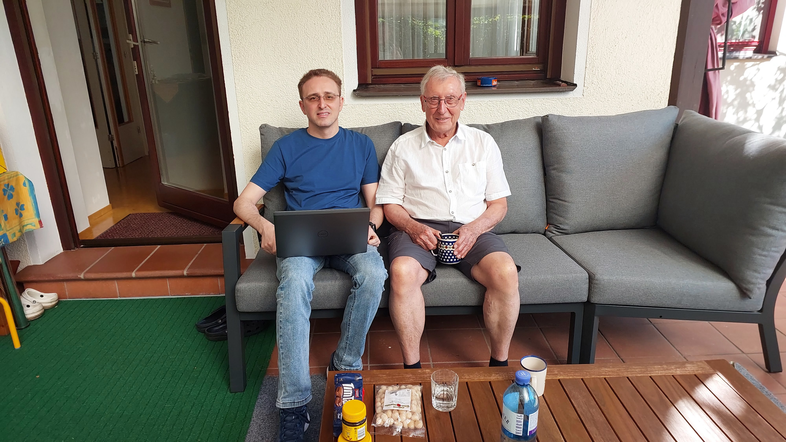
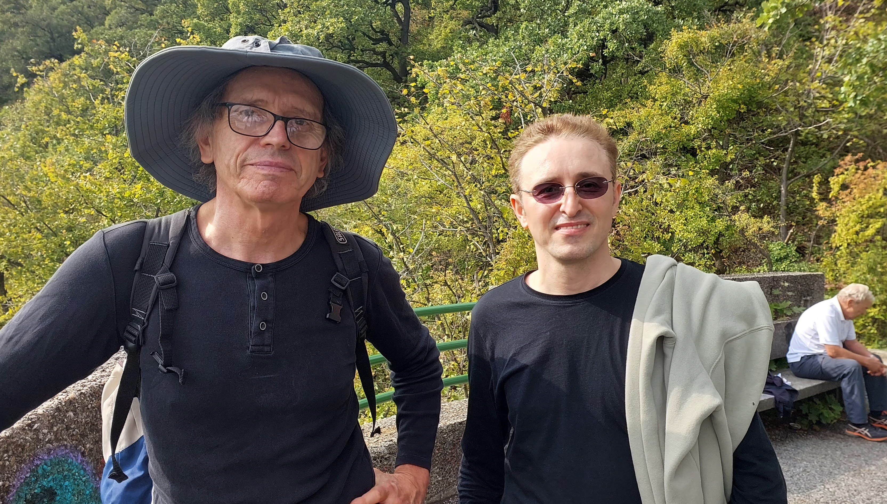

[Iman Shekarriz](author/iman-shekarriz) visited the Technical University of Leoben from September 18th to 22nd. There, he met with [Wilfried Imrich](http://imrich.at/) to discuss the theoretical advancement of soft happy colouring. Afterwards, they travelled together to at AGH university, Krakow, Poland to attend 10CCGT [10CCGT](https://www.10ccgt.agh.edu.pl/),  a large gathering of graph theorists from all over the world. He presented a talk titled "Soft Happy Colouring". Upon returning to Austria, Iman stayed at the Vienna University of Technology to visit [Karl Svozil](https://svozil.github.io/publications/) for some days. There, they discussed quantum chromatic contextuality.

<!--more-->

#   
