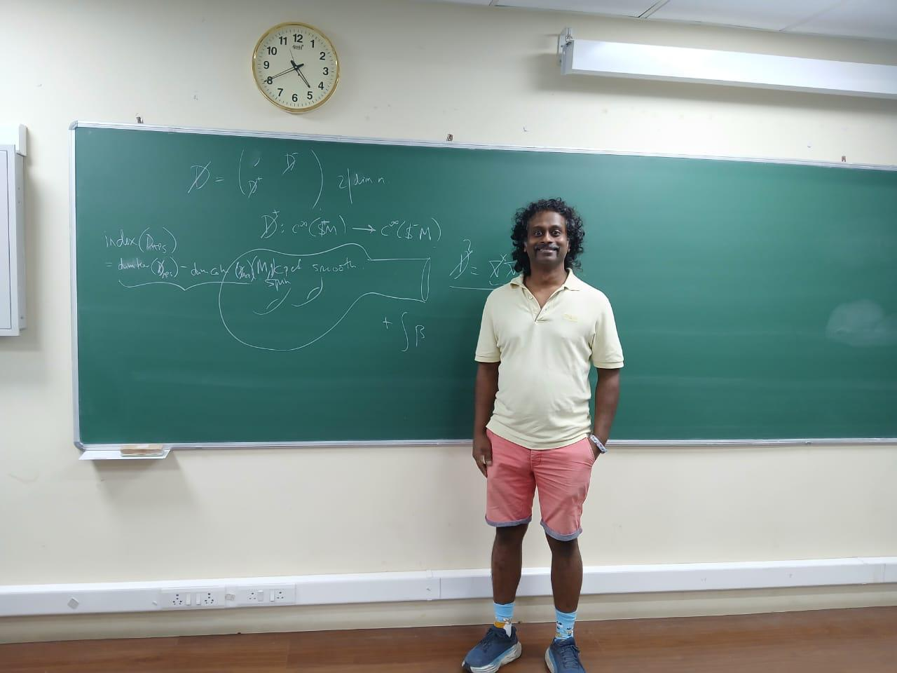
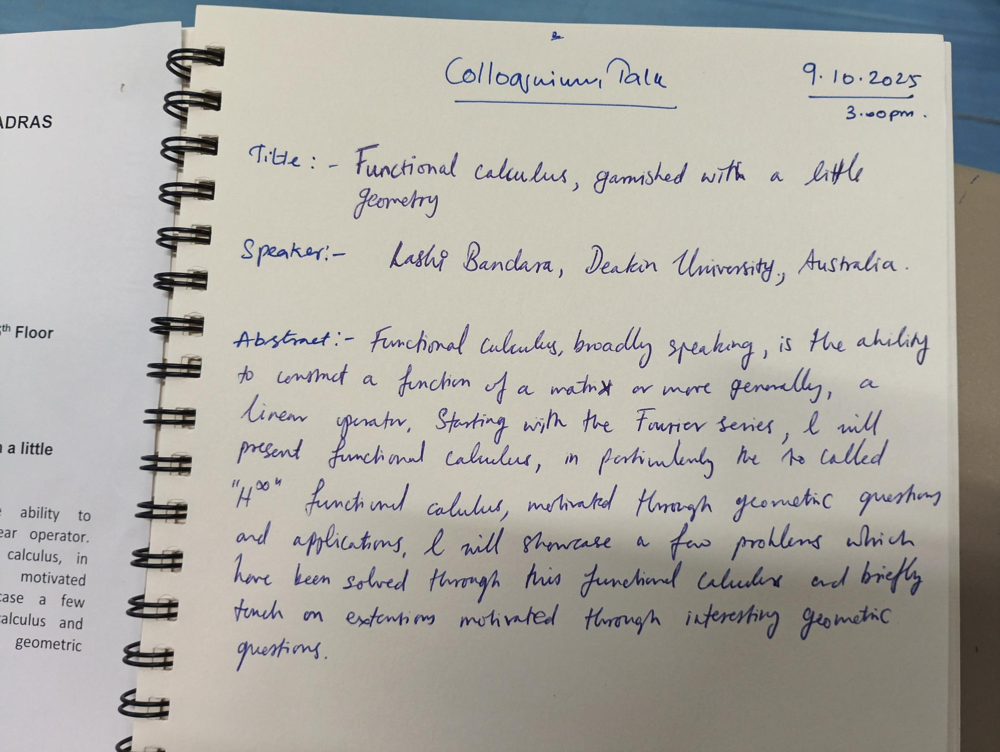
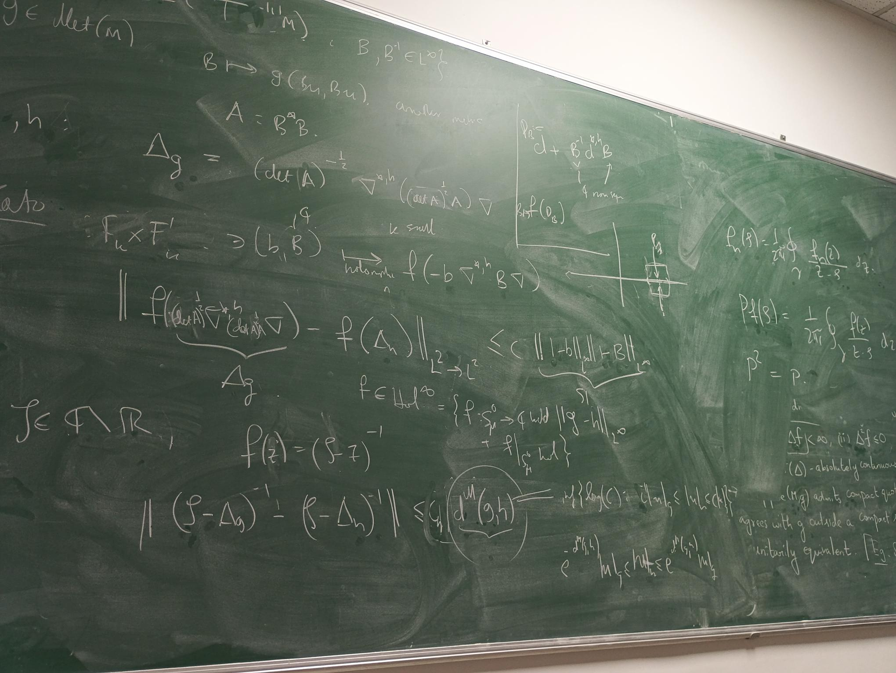
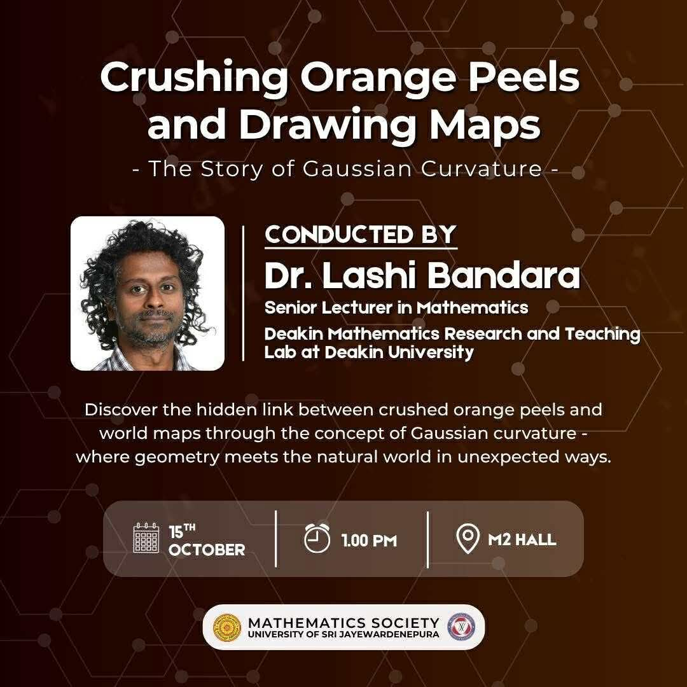
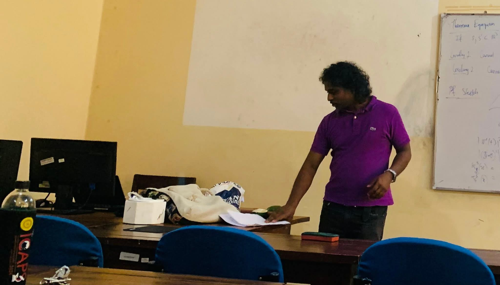
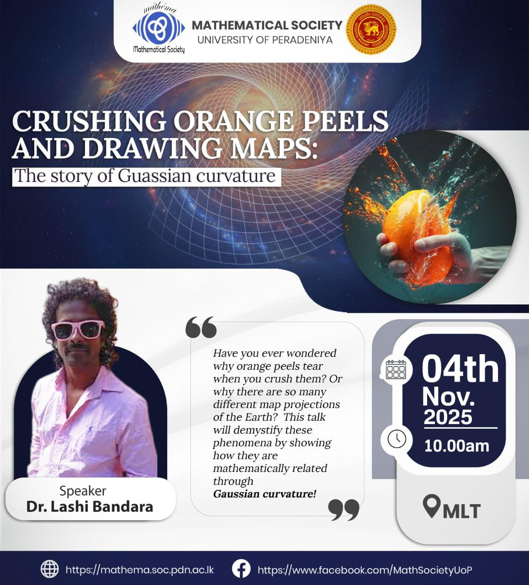
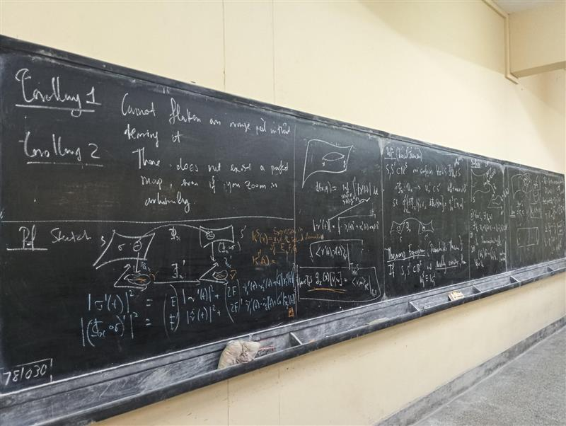
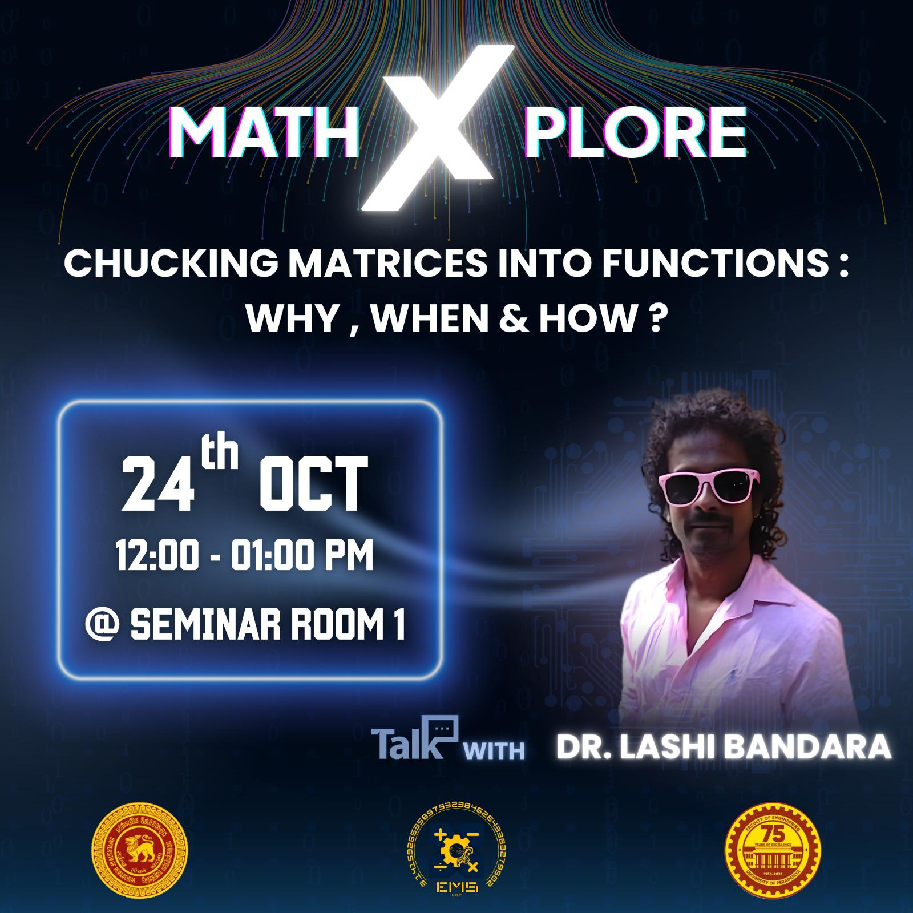
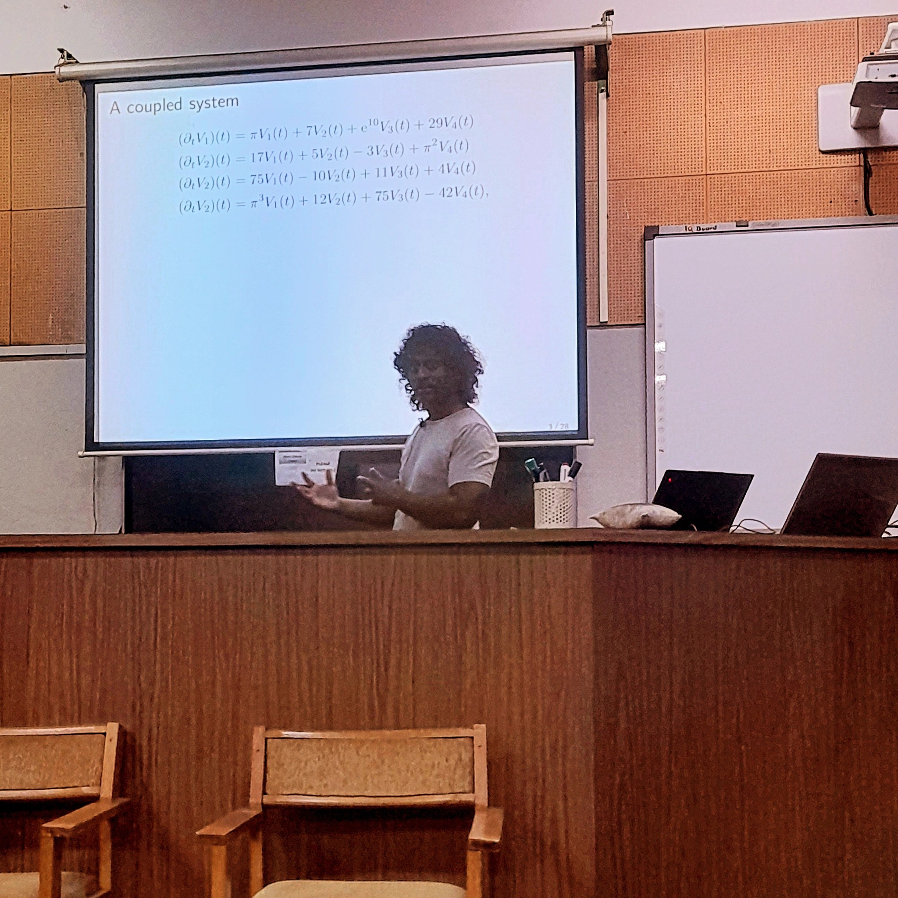

[Lashi Bandara](author/lashi-bandara) visited [Aprameyan Parthasarathy](https://math.iitm.ac.in//innerfaculty.php?fname=Aprameyan%20P) at  [IIT-Madras](https://math.iitm.ac.in/) on invitation from 6th to 10th October.

In the IIT-Madras Maths Colloquium, he gave a talk titled "Functional calculus, garnished with a little geometry". 

<!--more-->

IIT-Madras maintains a beautiful tradition of keeping a collection of their colloquium talks hand-written by the speaker into a book.

Together with B. Sivashankar, Aprameyan's PhD student, they discussed and began to collaborate on a project on understanding the stability of eigenvalues under rough metric convergence.

During his leave visiting extended family in Sri Lanka, Lashi was invited by [Thanuja Paragoda](https://science.sjp.ac.lk/mat/dr-p-g-t-harshani-2) from the [University of Sri Jayawardenapura](https://science.sjp.ac.lk/mat) to give a talk to their undergraduate students. He gave a talk titled "Crushing Orange Peels and Drawing Maps: the story of Gaussian curvature", organised by the [Mathematics Society](https://science.sjp.ac.lk/mat/mathematics-society/) of USJ.

 

He was also invited by [Ashwini Amarasinghe](https://sci.pdn.ac.lk/maths/staff/Ashwini-Amarasinghe) and [Gayana Jayasinghe](https://sites.google.com/view/gayanajayasinghe/home) from the [University of Peradeniya](https://pdn.ac.lk) and to give talks to their undergraduate students. Peradeniya has two departments of mathematics - one in the [Faculty of Science](https://sci.pdn.ac.lk/maths) and the other in the [Faculty of Enginnering](https://eng.pdn.ac.lk/maths/). He gave the same talk as for USJ for the Science Faculty students at Peradeniya, who are focused more on pure mathematics, organised by the [Mathematical Society](https://mathema.soc.pdn.ac.lk) of Peradeniya.

 

Lashi gave a chalkboard talk and he was very happy with the beautiful boards! 

 

For the Engineering faculty students, he gave a talk titled "Chucking matrices into functions: why, when and how?", organised by the [Engineering Mathematics Society](https://eng.pdn.ac.lk/maths/emsociety/).

 

Lashi also gave an invited research colloquium talk at the [University of Kelaniya](https://science.kln.ac.lk/depts/maths/) on invitation by [Shamon Almeida](https://science.kln.ac.lk/depts/maths/index.php/component/sppagebuilder/?view=page&id=53).

