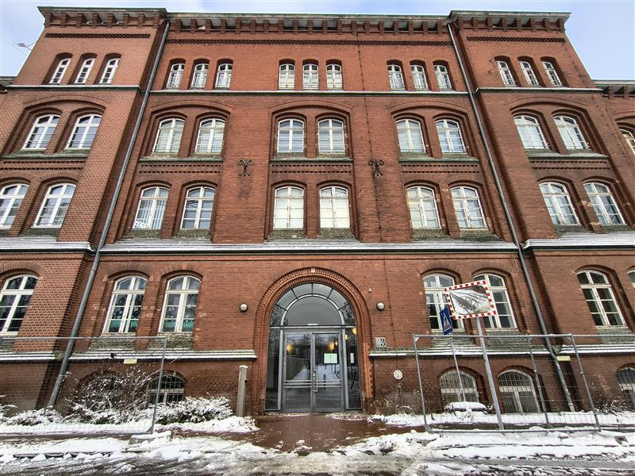
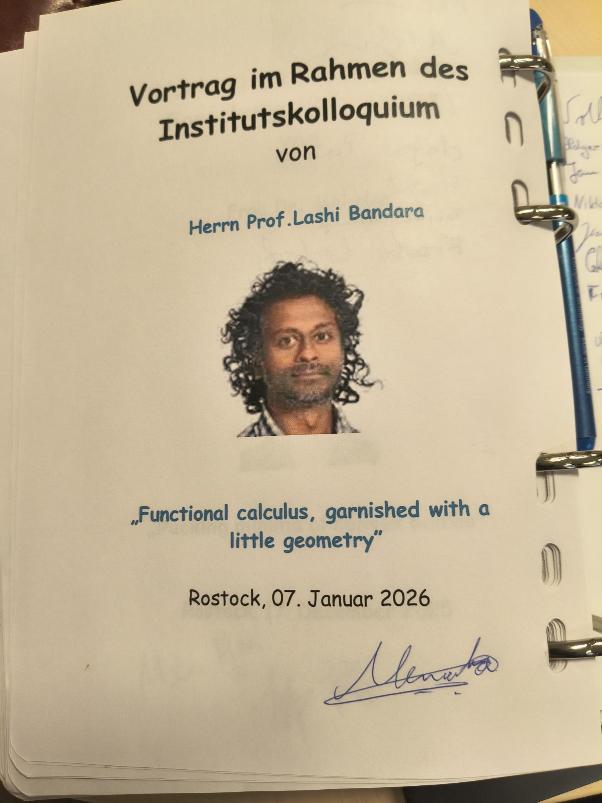
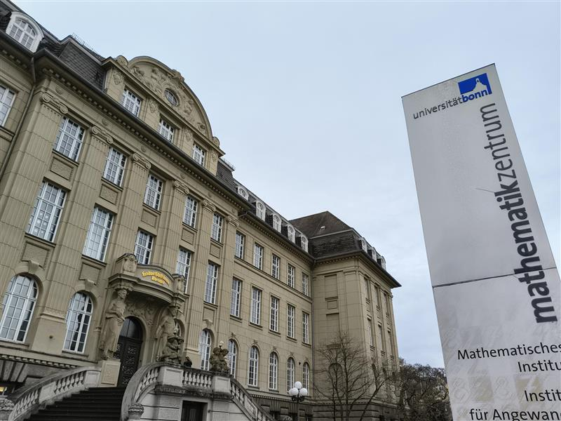
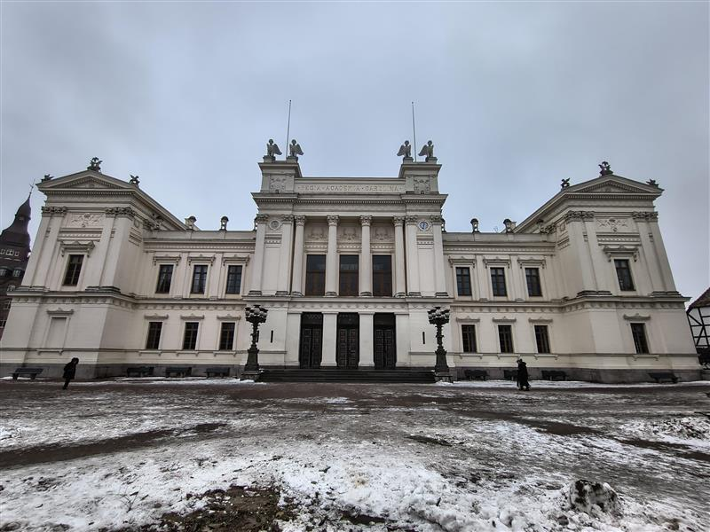
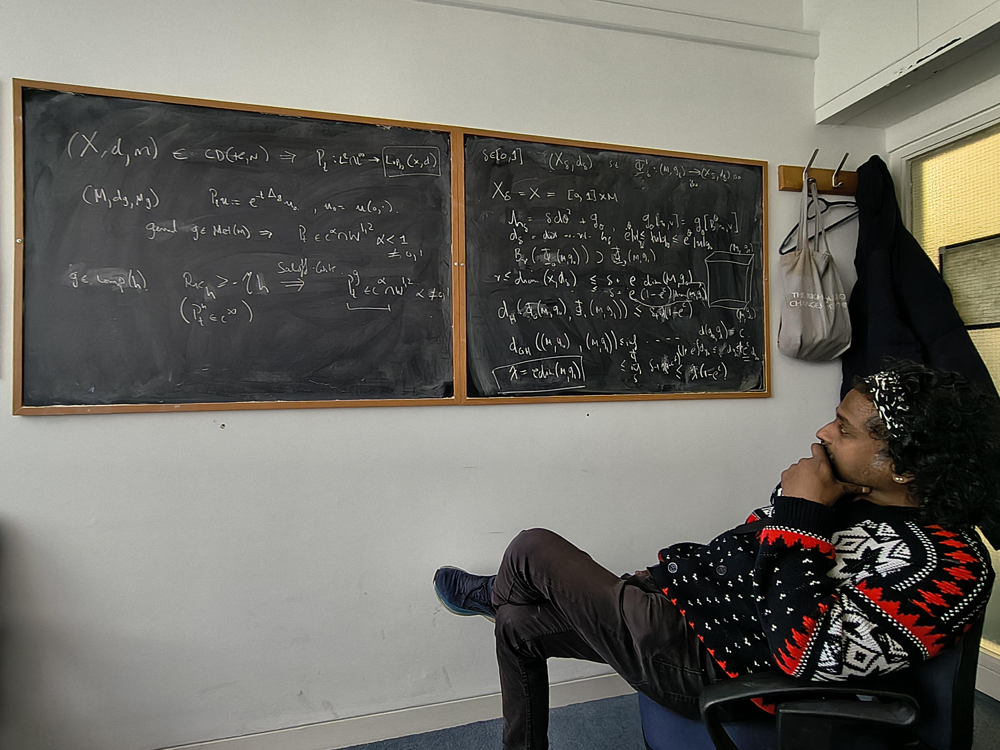
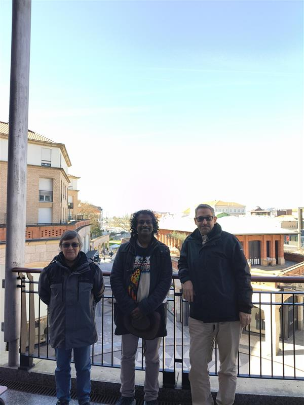
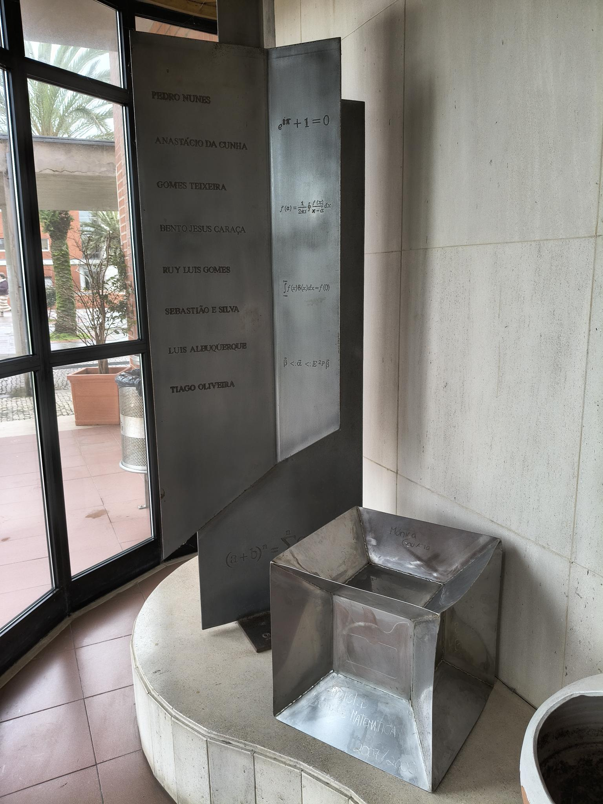
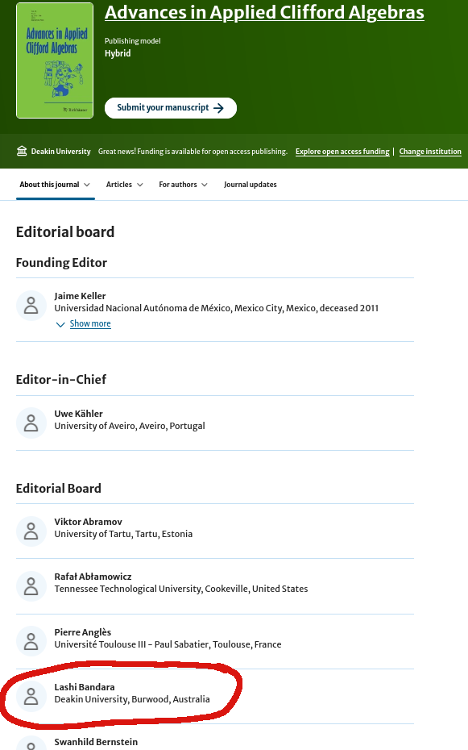
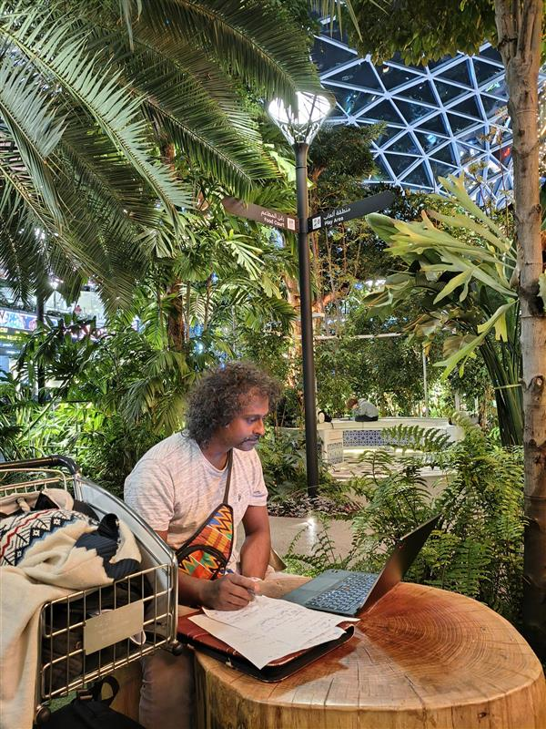

[Lashi Bandara](../author/lashi-bandara) was invited to visit number of research centres in Europe (Germany, Sweden, United Kingdom and Portugal) from mid-December 2025 till mid-February 2026. 

<!--more-->

Three weeks of his time was visiting the [Geometry group](https://www.math.uni-potsdam.de/en/professuren/geometry) at the [University of Potsdam](www.uni-potsdam.de) under the invitation of [Christian Bär](https://www.cbaer.eu/), Professor of Geometry.

He spent a week at the [University of Rostock](https://www.uni-rostock.de/en/) on invitation by [Volker Branding](http://www.volker-branding.eu/), Professor of Analysis. 

He began a collaboration with Volker and mutual collaborator and colleague [Georges Habib](https://iecl.univ-lorraine.fr/membre-iecl/habib-georges/) from the [Lebanese University](https://www.ul.edu.lb/en) to study spin-Dirac operators in low-regularity settings.

Lashi also delivered the Mathematics Colloquium there, and signed their colloquium book.

He visited [Eva-Maria Hekkelman](https://www.emhekkelman.nl/), currently a postdoc at the [Max-Plank Institute for Mathematics](https://www.mpim-bonn.mpg.de/) in Bonn to continue work on their project in collaboration with Ed McDonald, currently a postdoc at [Universite Paris-Est Créteil](https://www.u-pec.fr/) on spectral triples for rough metrics.

Lashi also gave a [talk](https://math-events.uni-bonn.de/event/1028/) in the [Global Analysis and Operator Algebras seminar](https://math-events.uni-bonn.de/category/15/) at the [University of Bonn](https://uni-bonn.de/).

Lashi visited [Magnus Goffeng](https://sites.google.com/view/magnus-goffeng/) at the [University of Lund](https://www.lunduniversity.lu.se/).  He delivered a talk in the Partial Differential Equations seminar and he was also invited to speak in the Pedagogical Colloquium, where he gave a talk titled [Co-constructive mastery based learning in mathematics](https://calendar.prodwebb8.lu.se/evenemang/co-constructive-mastery-based-learning-mathematics). 
His discussions with Magnus during his one-week visit led to a new project which they have begun to pursue. 

His Swedish trip ended with a visit to Alberto Richtsfeld, currently a postdoc at [Stockholm University](https://www.su.se/), to finish their work on an index formulae for the Rarita-Schwinger operator on manifolds with boundary.
He also gave a [talk](https://www.kth.se/math/kalender/diffgeom/lashi-bandara-trace-regularity-fredholmness-the-story-of-non-compact-boundary-for-first-order-elliptic-operators-1.1449134?date=2026-02-13&orgdate=2026-01-27&length=1&orglength=1) at [KTH Stockholm](https://www.kth.se) and interacted with his colleagues [Oliver Petersen](https://www.su.se/english/profiles/o/olli6489) and [Klaus Kröncke](https://www.kth.se/profile/kroncke), respectively Professors at SU and KTH. 

Lashi visited [Brunel University of London](https://www.brunel.ac.uk) and was delighted to be able to discuss mathematics with  his PhD student Anisa Hassan, at Brunel, on his old chalkboards.

He further delivered a talk there on recent work which he has done with Anisa.

His trip to the UK culminated in a visit to [Ali Taheri](https://profiles.sussex.ac.uk/p203434-ali-taheri), Professor of Analysis at the [University of Sussex](https://www.sussex.ac.uk/) where he also delivered a talk in the analysis seminar.

Lashi's final visit was for one-week to the [University of Aveiro](https://www.ua.pt/) to visit [Paula Cerejeiras](https://sweet.ua.pt/pceres/Webpage/Main.html) and [Uwe Kähler](https://sweet.ua.pt/ukaehler/Webpage/Main.html), both Professors in complex analysis.

Mathematics at Aveiro has a beautiful metal sculpture of important mathematical quantities as featured in the picture below. 

He gave a talk on his recent work on boundary value problems and spent time in discussions with Paula, Uwe and also  Simão Lucas, currently a PhD student at [Politecnico di Milano](https://www.polimi.it/).
These discussions ranged from discussions on boundary value problems to recent work on Hodge-decompositions for non-smooth metrics as well as the study of the set of all non-smooth metrics.
They have begun preliminary analysis for a project on inverse problems.

Lashi was also made an editor for the journal [Applied Analysis and Clifford Algebras](https://link.springer.com/journal/6), a journal under Springer-Nature.

On his return home, Lashi enjoyed working on some of the maths that was discussed with his collaborators in the tropical garden, called the [Orchard](https://dohahamadairport.com/relax/orchard), at Doha Airport!

